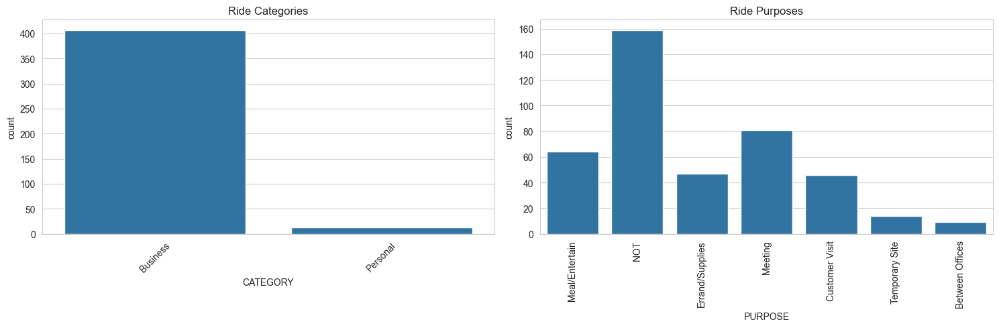
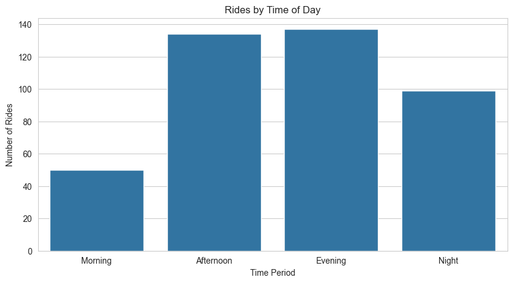
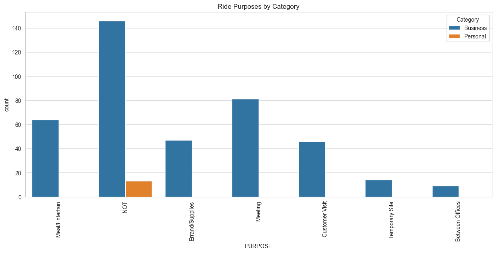
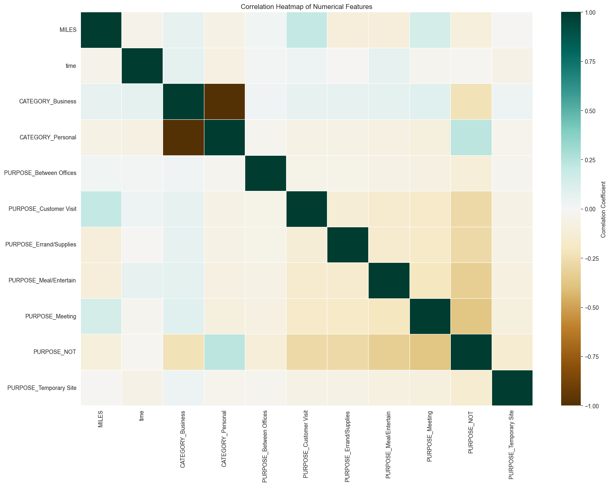
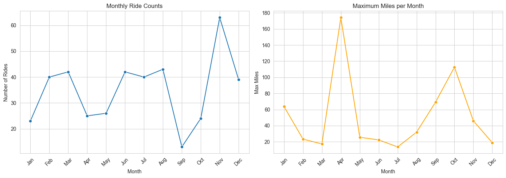
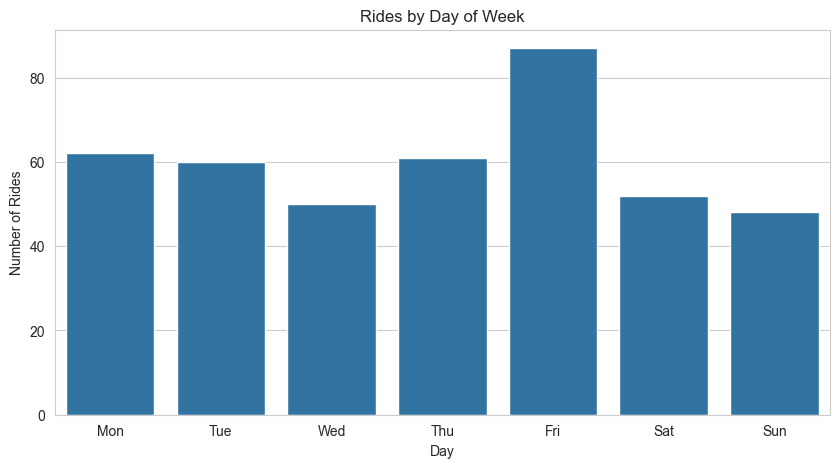
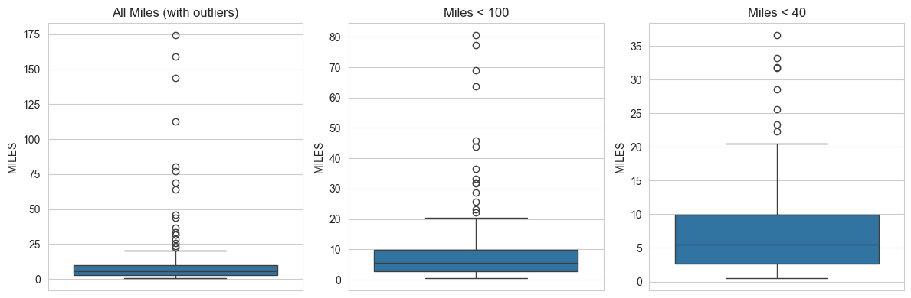
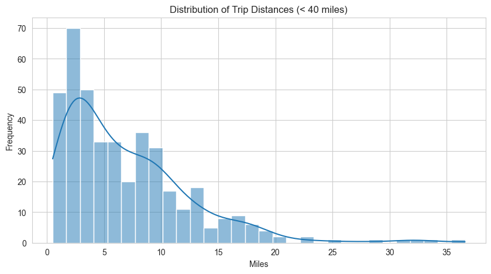

# 🚗 Uber Rides Data Analysis using Python

We will analyze Uber ride data to understand patterns in categories, purposes, timings, distances, and more.

## Step 1: Import Required Libraries


```python
import pandas as pd
import numpy as np
import matplotlib.pyplot as plt
import seaborn as sns
from datetime import datetime
from sklearn.preprocessing import OneHotEncoder
import warnings
warnings.filterwarnings('ignore')

# Set visualization style
sns.set_style("whitegrid")
plt.rcParams['figure.figsize'] = (12, 6)

print("Libraries imported successfully!")
```

    Libraries imported successfully!


## Step 2: Load the Dataset

We'll load the Uber dataset. **Make sure `UberDataset.csv` is in the same folder as this notebook.**

If you don't have the dataset, you can download it from the link provided in the tutorial.


```python
# Load the dataset
try:
    dataset = pd.read_csv("UberDataset.csv")
    print(f"Dataset loaded successfully! Shape: {dataset.shape}")
    print(f"\nFirst 5 rows:")
    dataset.head()
except FileNotFoundError:
    print("Error: 'UberDataset.csv' not found. Please place the file in the current directory.")
```

    Dataset loaded successfully! Shape: (1156, 7)
    
    First 5 rows:


## Step 3: Understand the Dataset Structure


```python
# Check dataset shape
print(f"Dataset shape: {dataset.shape}")
print(f"\nDataset info:")
dataset.info()

# Check for missing values
print("\nMissing values:")
print(dataset.isnull().sum())
```

    Dataset shape: (1156, 7)
    
    Dataset info:
    <class 'pandas.core.frame.DataFrame'>
    RangeIndex: 1156 entries, 0 to 1155
    Data columns (total 7 columns):
     #   Column      Non-Null Count  Dtype  
    ---  ------      --------------  -----  
     0   START_DATE  1156 non-null   object 
     1   END_DATE    1155 non-null   object 
     2   CATEGORY    1155 non-null   object 
     3   START       1155 non-null   object 
     4   STOP        1155 non-null   object 
     5   MILES       1156 non-null   float64
     6   PURPOSE     653 non-null    object 
    dtypes: float64(1), object(6)
    memory usage: 63.3+ KB
    
    Missing values:
    START_DATE      0
    END_DATE        1
    CATEGORY        1
    START           1
    STOP            1
    MILES           0
    PURPOSE       503
    dtype: int64


## Step 4: Data Preprocessing

### 4.1 Handle Missing Values in PURPOSE Column


```python
# Fill missing PURPOSE values with "NOT"
dataset['PURPOSE'].fillna("NOT", inplace=True)
print("Missing PURPOSE values filled with 'NOT'")
print(f"Unique purposes now: {dataset['PURPOSE'].unique()}")
```

    Missing PURPOSE values filled with 'NOT'
    Unique purposes now: ['Meal/Entertain' 'NOT' 'Errand/Supplies' 'Meeting' 'Customer Visit'
     'Temporary Site' 'Between Offices' 'Charity ($)' 'Commute' 'Moving'
     'Airport/Travel']


### 4.2 Convert START_DATE and END_DATE to datetime


```python
# Convert to datetime format
dataset['START_DATE'] = pd.to_datetime(dataset['START_DATE'], errors='coerce')
dataset['END_DATE'] = pd.to_datetime(dataset['END_DATE'], errors='coerce')

print("START_DATE and END_DATE converted to datetime")
dataset[['START_DATE', 'END_DATE']].head()
```

    START_DATE and END_DATE converted to datetime


<div>
<style scoped>
    .dataframe tbody tr th:only-of-type {
        vertical-align: middle;
    }

    .dataframe tbody tr th {
        vertical-align: top;
    }

    .dataframe thead th {
        text-align: right;
    }
</style>
<table border="1" class="dataframe">
  <thead>
    <tr style="text-align: right;">
      <th></th>
      <th>START_DATE</th>
      <th>END_DATE</th>
    </tr>
  </thead>
  <tbody>
    <tr>
      <th>0</th>
      <td>2016-01-01 21:11:00</td>
      <td>2016-01-01 21:17:00</td>
    </tr>
    <tr>
      <th>1</th>
      <td>2016-01-02 01:25:00</td>
      <td>2016-01-02 01:37:00</td>
    </tr>
    <tr>
      <th>2</th>
      <td>2016-01-02 20:25:00</td>
      <td>2016-01-02 20:38:00</td>
    </tr>
    <tr>
      <th>3</th>
      <td>2016-01-05 17:31:00</td>
      <td>2016-01-05 17:45:00</td>
    </tr>
    <tr>
      <th>4</th>
      <td>2016-01-06 14:42:00</td>
      <td>2016-01-06 15:49:00</td>
    </tr>
  </tbody>
</table>
</div>


### 4.3 Extract Date, Time, and Day/Night Categories


```python
# Extract date and hour
dataset['date'] = pd.DatetimeIndex(dataset['START_DATE']).date
dataset['time'] = pd.DatetimeIndex(dataset['START_DATE']).hour

# Categorize into day/night periods
dataset['day-night'] = pd.cut(x=dataset['time'],
                              bins=[0, 10, 15, 19, 24],
                              labels=['Morning', 'Afternoon', 'Evening', 'Night'],
                              right=False)

print("Date and time features extracted:")
print(dataset[['date', 'time', 'day-night']].head())
```

    Date and time features extracted:
             date  time  day-night
    0  2016-01-01  21.0      Night
    1  2016-01-02   1.0    Morning
    2  2016-01-02  20.0      Night
    3  2016-01-05  17.0    Evening
    4  2016-01-06  14.0  Afternoon


### 4.4 Drop Rows with Null Values and Duplicates


```python
# Drop rows with any null values
initial_shape = dataset.shape
dataset.dropna(inplace=True)
print(f"Rows after dropping nulls: {dataset.shape[0]} (dropped {initial_shape[0] - dataset.shape[0]})")

# Drop duplicate rows
initial_shape = dataset.shape
dataset.drop_duplicates(inplace=True)
print(f"Rows after dropping duplicates: {dataset.shape[0]} (dropped {initial_shape[0] - dataset.shape[0]})")

print(f"\nFinal dataset shape: {dataset.shape}")
```

    Rows after dropping nulls: 420 (dropped 736)
    Rows after dropping duplicates: 420 (dropped 0)
    
    Final dataset shape: (420, 10)


## Step 5: Data Visualization

### 5.1 Check Unique Values in Categorical Columns


```python
# Identify object-type columns
obj = (dataset.dtypes == 'object')
object_cols = list(obj[obj].index)
print(f"Categorical columns: {object_cols}")

# Count unique values in each categorical column
unique_values = {}
for col in object_cols:
    unique_values[col] = dataset[col].nunique()

print("\nUnique values in categorical columns:")
for col, count in unique_values.items():
    print(f"- {col}: {count}")
```

    Categorical columns: ['CATEGORY', 'START', 'STOP', 'PURPOSE', 'date']
    
    Unique values in categorical columns:
    - CATEGORY: 2
    - START: 109
    - STOP: 113
    - PURPOSE: 7
    - date: 114


### 5.2 Count Plots for CATEGORY and PURPOSE


```python
plt.figure(figsize=(15, 5))

plt.subplot(1, 2, 1)
sns.countplot(data=dataset, x='CATEGORY')
plt.title('Ride Categories')
plt.xticks(rotation=45)

plt.subplot(1, 2, 2)
sns.countplot(data=dataset, x='PURPOSE')
plt.title('Ride Purposes')
plt.xticks(rotation=90)

plt.tight_layout()
plt.show()
```


    

    


**Insights:**
- Most rides are for **Business** purposes
- Top purposes: **Meetings** and **Meal/Entertain**

### 5.3 Ride Distribution by Time of Day


```python
plt.figure(figsize=(10, 5))
sns.countplot(data=dataset, x='day-night', order=['Morning', 'Afternoon', 'Evening', 'Night'])
plt.title('Rides by Time of Day')
plt.xlabel('Time Period')
plt.ylabel('Number of Rides')
plt.show()

print("Most rides are booked during Afternoon (10am-5pm)")
```


    

    


    Most rides are booked during Afternoon (10am-5pm)


### 5.4 PURPOSE vs CATEGORY Comparison


```python
plt.figure(figsize=(15, 6))
sns.countplot(data=dataset, x='PURPOSE', hue='CATEGORY')
plt.title('Ride Purposes by Category')
plt.xticks(rotation=90)
plt.legend(title='Category')
plt.show()
```


    

    


## Step 6: Feature Engineering for Correlation Analysis

### 6.1 One-Hot Encode CATEGORY and PURPOSE


```python
# Select columns to encode
encode_cols = ['CATEGORY', 'PURPOSE']

# Apply OneHotEncoder
OH_encoder = OneHotEncoder(sparse_output=False, handle_unknown='ignore')
OH_cols = pd.DataFrame(OH_encoder.fit_transform(dataset[encode_cols]))
OH_cols.index = dataset.index
OH_cols.columns = OH_encoder.get_feature_names_out(encode_cols)

# Drop original columns and concatenate encoded ones
df_final = dataset.drop(encode_cols, axis=1)
dataset_encoded = pd.concat([df_final, OH_cols], axis=1)

print(f"Original shape: {dataset.shape}")
print(f"Encoded shape: {dataset_encoded.shape}")
print("\nFirst few encoded columns:")
dataset_encoded.iloc[:, :10].head()
```

    Original shape: (420, 10)
    Encoded shape: (420, 17)
    
    First few encoded columns:


<div>
<style scoped>
    .dataframe tbody tr th:only-of-type {
        vertical-align: middle;
    }

    .dataframe tbody tr th {
        vertical-align: top;
    }

    .dataframe thead th {
        text-align: right;
    }
</style>
<table border="1" class="dataframe">
  <thead>
    <tr style="text-align: right;">
      <th></th>
      <th>START_DATE</th>
      <th>END_DATE</th>
      <th>START</th>
      <th>STOP</th>
      <th>MILES</th>
      <th>date</th>
      <th>time</th>
      <th>day-night</th>
      <th>CATEGORY_Business</th>
      <th>CATEGORY_Personal</th>
    </tr>
  </thead>
  <tbody>
    <tr>
      <th>0</th>
      <td>2016-01-01 21:11:00</td>
      <td>2016-01-01 21:17:00</td>
      <td>Fort Pierce</td>
      <td>Fort Pierce</td>
      <td>5.1</td>
      <td>2016-01-01</td>
      <td>21.0</td>
      <td>Night</td>
      <td>1.0</td>
      <td>0.0</td>
    </tr>
    <tr>
      <th>1</th>
      <td>2016-01-02 01:25:00</td>
      <td>2016-01-02 01:37:00</td>
      <td>Fort Pierce</td>
      <td>Fort Pierce</td>
      <td>5.0</td>
      <td>2016-01-02</td>
      <td>1.0</td>
      <td>Morning</td>
      <td>1.0</td>
      <td>0.0</td>
    </tr>
    <tr>
      <th>2</th>
      <td>2016-01-02 20:25:00</td>
      <td>2016-01-02 20:38:00</td>
      <td>Fort Pierce</td>
      <td>Fort Pierce</td>
      <td>4.8</td>
      <td>2016-01-02</td>
      <td>20.0</td>
      <td>Night</td>
      <td>1.0</td>
      <td>0.0</td>
    </tr>
    <tr>
      <th>3</th>
      <td>2016-01-05 17:31:00</td>
      <td>2016-01-05 17:45:00</td>
      <td>Fort Pierce</td>
      <td>Fort Pierce</td>
      <td>4.7</td>
      <td>2016-01-05</td>
      <td>17.0</td>
      <td>Evening</td>
      <td>1.0</td>
      <td>0.0</td>
    </tr>
    <tr>
      <th>4</th>
      <td>2016-01-06 14:42:00</td>
      <td>2016-01-06 15:49:00</td>
      <td>Fort Pierce</td>
      <td>West Palm Beach</td>
      <td>63.7</td>
      <td>2016-01-06</td>
      <td>14.0</td>
      <td>Afternoon</td>
      <td>1.0</td>
      <td>0.0</td>
    </tr>
  </tbody>
</table>
</div>


### 6.2 Correlation Heatmap


```python
# Select only numerical columns for correlation
numeric_dataset = dataset_encoded.select_dtypes(include=['number'])

plt.figure(figsize=(16, 12))
sns.heatmap(numeric_dataset.corr(), 
            cmap='BrBG', 
            fmt='.2f', 
            linewidths=0.5, 
            annot=False,  # Set to True to see values, but it's crowded
            cbar_kws={'label': 'Correlation Coefficient'})
plt.title('Correlation Heatmap of Numerical Features')
plt.tight_layout()
plt.show()

print("Key observation: Business and Personal categories are highly negatively correlated.")
```


    

    


    Key observation: Business and Personal categories are highly negatively correlated.


## Step 7: Monthly Analysis


```python
# Extract month from START_DATE
dataset['MONTH'] = pd.DatetimeIndex(dataset['START_DATE']).month

# Map month numbers to names
month_label = {1: 'Jan', 2: 'Feb', 3: 'Mar', 4: 'Apr',
               5: 'May', 6: 'Jun', 7: 'Jul', 8: 'Aug',
               9: 'Sep', 10: 'Oct', 11: 'Nov', 12: 'Dec'}
dataset["MONTH"] = dataset.MONTH.map(month_label)

# Count rides per month
month_counts = dataset['MONTH'].value_counts(sort=False)

# Create dataframe with monthly stats
monthly_stats = pd.DataFrame({
    "Total Rides": month_counts,
    "Max Miles": dataset.groupby('MONTH', sort=False)['MILES'].max()
})

print("Monthly Statistics:")
monthly_stats
```

    Monthly Statistics:


<div>
<style scoped>
    .dataframe tbody tr th:only-of-type {
        vertical-align: middle;
    }

    .dataframe tbody tr th {
        vertical-align: top;
    }

    .dataframe thead th {
        text-align: right;
    }
</style>
<table border="1" class="dataframe">
  <thead>
    <tr style="text-align: right;">
      <th></th>
      <th>Total Rides</th>
      <th>Max Miles</th>
    </tr>
    <tr>
      <th>MONTH</th>
      <th></th>
      <th></th>
    </tr>
  </thead>
  <tbody>
    <tr>
      <th>Jan</th>
      <td>23</td>
      <td>63.7</td>
    </tr>
    <tr>
      <th>Feb</th>
      <td>40</td>
      <td>23.3</td>
    </tr>
    <tr>
      <th>Mar</th>
      <td>42</td>
      <td>17.3</td>
    </tr>
    <tr>
      <th>Apr</th>
      <td>25</td>
      <td>174.2</td>
    </tr>
    <tr>
      <th>May</th>
      <td>26</td>
      <td>25.6</td>
    </tr>
    <tr>
      <th>Jun</th>
      <td>42</td>
      <td>22.3</td>
    </tr>
    <tr>
      <th>Jul</th>
      <td>40</td>
      <td>13.6</td>
    </tr>
    <tr>
      <th>Aug</th>
      <td>43</td>
      <td>31.9</td>
    </tr>
    <tr>
      <th>Sep</th>
      <td>13</td>
      <td>69.1</td>
    </tr>
    <tr>
      <th>Oct</th>
      <td>24</td>
      <td>112.6</td>
    </tr>
    <tr>
      <th>Nov</th>
      <td>63</td>
      <td>45.9</td>
    </tr>
    <tr>
      <th>Dec</th>
      <td>39</td>
      <td>18.9</td>
    </tr>
  </tbody>
</table>
</div>


```python
# Plot monthly trends
plt.figure(figsize=(14, 5))

plt.subplot(1, 2, 1)
sns.lineplot(data=monthly_stats, x=monthly_stats.index, y='Total Rides', marker='o')
plt.title('Monthly Ride Counts')
plt.xlabel('Month')
plt.ylabel('Number of Rides')
plt.xticks(rotation=45)

plt.subplot(1, 2, 2)
sns.lineplot(data=monthly_stats, x=monthly_stats.index, y='Max Miles', marker='o', color='orange')
plt.title('Maximum Miles per Month')
plt.xlabel('Month')
plt.ylabel('Max Miles')
plt.xticks(rotation=45)

plt.tight_layout()
plt.show()

print("Observation: Fewer rides in winter months (Nov-Jan)")
```


    

    


    Observation: Fewer rides in winter months (Nov-Jan)


## Step 8: Day of Week Analysis


```python
# Extract day of week (0=Monday, 6=Sunday)
dataset['DAY'] = pd.DatetimeIndex(dataset['START_DATE']).weekday

# Map to day names
day_label = {0: 'Mon', 1: 'Tue', 2: 'Wed', 3: 'Thu', 4: 'Fri', 5: 'Sat', 6: 'Sun'}
dataset['DAY'] = dataset['DAY'].map(day_label)

# Count rides per day
day_counts = dataset['DAY'].value_counts()

# Reorder for proper display
day_order = ['Mon', 'Tue', 'Wed', 'Thu', 'Fri', 'Sat', 'Sun']
day_counts = day_counts.reindex(day_order)

# Plot
plt.figure(figsize=(10, 5))
sns.barplot(x=day_counts.index, y=day_counts.values)
plt.title('Rides by Day of Week')
plt.xlabel('Day')
plt.ylabel('Number of Rides')
plt.show()
```


    

    


## Step 9: MILES Distribution Analysis


```python
# Boxplot of all MILES
plt.figure(figsize=(12, 4))

plt.subplot(1, 3, 1)
sns.boxplot(y=dataset['MILES'])
plt.title('All Miles (with outliers)')

plt.subplot(1, 3, 2)
sns.boxplot(y=dataset[dataset['MILES'] < 100]['MILES'])
plt.title('Miles < 100')

plt.subplot(1, 3, 3)
sns.boxplot(y=dataset[dataset['MILES'] < 40]['MILES'])
plt.title('Miles < 40')

plt.tight_layout()
plt.show()
```


    

    


```python
# Distribution plot for short trips
plt.figure(figsize=(10, 5))
sns.histplot(dataset[dataset['MILES'] < 40]['MILES'], bins=30, kde=True)
plt.title('Distribution of Trip Distances (< 40 miles)')
plt.xlabel('Miles')
plt.ylabel('Frequency')
plt.show()

print("Key insights:")
print("- Most trips are 4-5 miles")
print("- Majority of trips are under 20 miles")
print("- Trips over 20 miles are rare")
```


    

    


    Key insights:
    - Most trips are 4-5 miles
    - Majority of trips are under 20 miles
    - Trips over 20 miles are rare


## Summary of Key Insights

From this analysis, we discovered:

1. **Ride Purpose**: Most rides are for **Business**, especially **Meetings** and **Meal/Entertain**
2. **Peak Timing**: Afternoon (10am-5pm) is the busiest time
3. **Seasonal Pattern**: Fewer rides in winter months (Nov-Jan)
4. **Trip Distance**: 
   - Most trips are **4-5 miles**
   - Majority are **under 20 miles**
   - Long trips (>20 miles) are rare
5. **Category Correlation**: Business and Personal categories are strongly negatively correlated


```python

```
